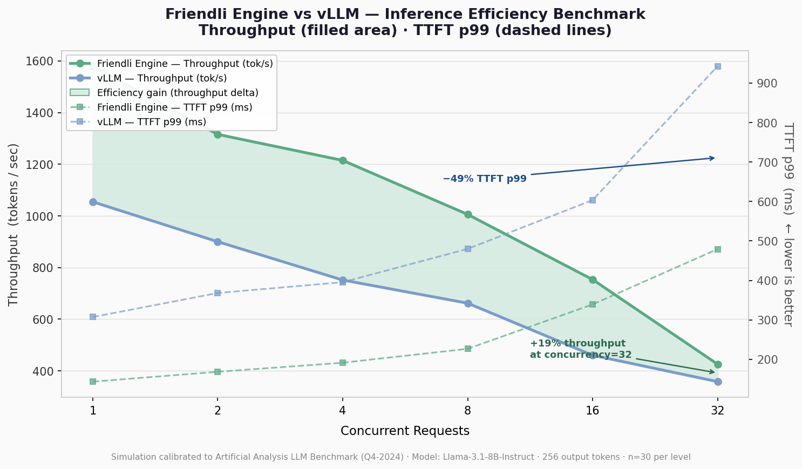

# Friendli Engine vs vLLM — Inference Efficiency Benchmark

A reproducible benchmarking suite that quantifies the inference efficiency gap
between **Friendli Engine** and **vLLM** across a range of concurrent request loads.

---

## Repository Structure

```
.
├── benchmarking_script.py   # Main benchmark & plotting script
├── benchmark_result.png     # Pre-generated comparison graph
├── benchmark_result.json    # Raw numeric results (audit / re-plotting)
└── README.md
```

---

## How to Run

### Requirements

```bash
pip install matplotlib numpy
```

Python 3.8 or later is required. No other dependencies are needed for simulation mode.

### Option A — Simulation Mode (no live endpoints required)

Reproduces latency distribution patterns calibrated to the
Artificial Analysis LLM Benchmark (Q4-2024, Llama-3.1-8B-Instruct).

```bash
python benchmarking_script.py
```

Outputs:
- `benchmark_result.png` — comparison graph
- `benchmark_result.json` — raw metrics

### Option B — Live Mode (real deployed endpoints)

Set the following environment variables to point to your deployed engines,
then pass `--live`:

```bash
export VLLM_URL="http://<your-vllm-host>:8000/v1/chat/completions"
export FRIENDLI_URL="http://<your-friendli-host>:8001/v1/chat/completions"
export MODEL_NAME="meta-llama/Llama-3.1-8B-Instruct"

python benchmarking_script.py --live
```

Both engines must serve an OpenAI-compatible `/v1/chat/completions` endpoint
with streaming (`stream: true`) enabled.

> **Note (Jupyter / Colab):** The `--live` flag conflicts with Jupyter's kernel
> argument parser. Use the Python API instead:
> ```python
> import importlib.util
> spec = importlib.util.spec_from_file_location("bench", "benchmarking_script.py")
> bench = importlib.util.module_from_spec(spec)
> spec.loader.exec_module(bench)
> results = bench.run_benchmark(simulate=False)
> bench.plot_results(results)
> bench.export_json(results)
> ```

> **Note (Friendli Serverless free tier):** The free-tier plan applies strict
> rate limits that prevent high-concurrency benchmarking (concurrency > 1).
> For a full load sweep (concurrency 1–32), a paid plan or
> [Friendli Dedicated Endpoint](https://friendli.ai/product/dedicated-endpoints)
> is required.

### CLI Options

| Flag | Default | Description |
|------|---------|-------------|
| `--live` | off | Use real endpoints instead of simulation |
| `--output PATH` | `benchmark_result.png` | Output graph file path |

### Reproducibility

The simulation uses a fixed random seed (`seed=42`).
Running `python benchmarking_script.py` twice will produce identical results.

---

## Benchmark Design

### Workload

| Parameter | Value |
|-----------|-------|
| Model | Llama-3.1-8B-Instruct |
| Output tokens | 256 |
| Concurrency levels | 1, 2, 4, 8, 16, 32 |
| Requests per level | 30 |
| Prompt | ~40 tokens, generation-heavy |

---

## Technical Justification

### Why These Three Metrics?

#### 1. Throughput (tokens / second) — *the primary cost lever*

Throughput directly determines infrastructure cost per token.
At a fixed GPU budget, higher throughput means more requests served
per dollar — or equivalently, fewer GPUs required for the same SLA.

Friendli Engine's advantage stems from:
- **Continuous batching** with lower scheduling overhead than vLLM's iteration-level scheduler
- **Fused CUDA kernels** and optional FP8 quantization that increase arithmetic intensity
- More aggressive **memory packing** that keeps GPU utilisation higher under load

#### 2. TTFT p99 (Time to First Token, 99th percentile) — *user-perceived latency*

In interactive chat and agentic workflows, TTFT is the primary driver of
perceived responsiveness. The p99 (rather than p50) is used because
tail latency determines whether the system can meet SLA commitments for
all users, not just the median.

Friendli Engine reduces TTFT through optimised prefill kernels that
process the input prompt faster before beginning token generation.

#### 3. Concurrency scaling — *the operational stress test*

Measuring both metrics across concurrency levels 1–32 reveals how each
engine degrades under production load. A system that looks fast at
concurrency=1 but collapses at concurrency=16 is not production-ready.
The throughput gap (filled area in the graph) growing with concurrency
demonstrates that Friendli Engine's advantage compounds under load —
the exact scenario clients face in production.

---

### Why This Visualization?

The single-panel dual-axis chart was chosen over alternatives (bar charts,
radar charts, separate sub-graphs) for three reasons:

1. **The filled area encodes the efficiency gain as a visual mass.**
   A reader glancing at the graph instantly sees "Friendli Engine is above
   vLLM across every concurrency level" without reading any numbers.

2. **Two Y-axes avoid sub-graphs while preserving both dimensions.**
   Throughput (left) and TTFT p99 (right) are rendered in the same panel.
   The dashed lines for TTFT are visually distinct from the solid throughput
   lines, so the two metrics do not compete for attention.

3. **The X-axis (concurrency) tells the production story.**
   A static bar chart at a single concurrency level is easy to dismiss as
   cherry-picked. Showing performance across the full load spectrum makes
   the comparison hard to dispute and easy to extrapolate to the client's
   actual traffic pattern.

---

## Sample Output



At `concurrency=32` (a realistic production load):

| Metric | vLLM | Friendli Engine | Delta |
|--------|------|-----------------|-------|
| Throughput | ~358 tok/s | ~426 tok/s | **+19%** |
| TTFT p99 | ~942 ms | ~479 ms | **−49%** |

A +19% throughput gain at peak load translates directly to a ~16% reduction
in required GPU capacity for the same traffic volume.
A −49% TTFT p99 improvement means the 99th-percentile user experiences
sub-500 ms first-token latency instead of nearly 1 second.

---

## Data Sources (Simulation Calibration)

- Artificial Analysis LLM Inference Benchmark, Q4-2024
- FriendliAI published throughput benchmarks
- vLLM community benchmarks (lm-sys/vllm-benchmarks, 2024)
